# Coral growth simulator

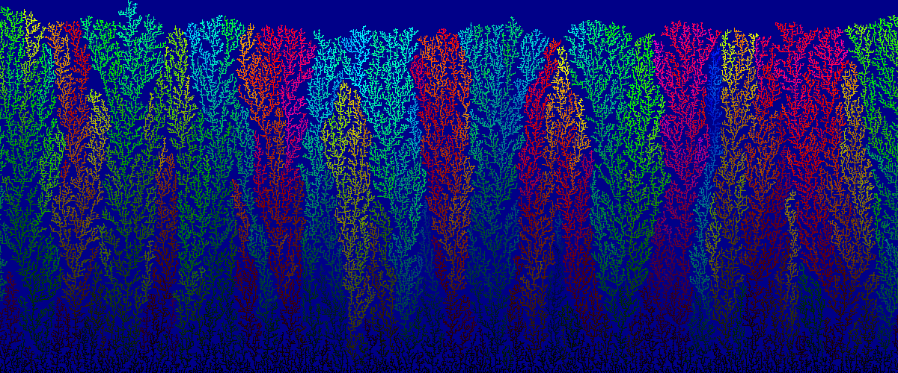

## Principles

This simulator generates patterns that grow like real corals.

Cells are placed randomly along the top edge of the image. They drift at random, with a bias towards falling downwards.

When a drifting cell encounters the bottom edge of the image, it takes root and forms a new coral. When it encounters an existing coral, it attaches to it.

The simulation continues until a coral reaches the top edge.

You can render still images or animations.

**[Watch an example growth animation](examples/growth.mp4)**

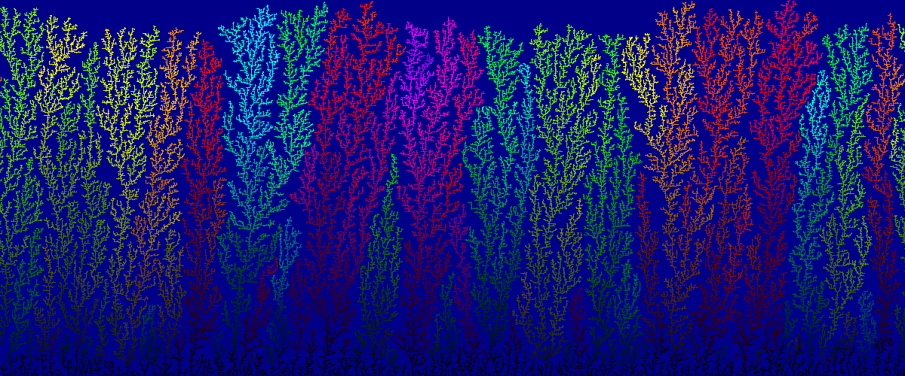

## Basic usage

Requires [Pillow](https://python-pillow.org/).

Generate an image with preset parameters and save it as `coral.png`:

````
python img_coral.py coral.png
````

Generate your own pattern:

````python
nb_rows, nb_cols = 200, 300
board = Board(nb_rows, nb_cols)
board.run()
image = board.print_to_image()
image.show()
````

## `Board` options

| Argument       | Type          | Default      | Effect                                                        |
|----------------|---------------|-------------:|---------------------------------------------------------------|
| `nb_rows`      | int > 0       | **Required** | image height in pixels                                        |
| `nb_cols`      | int > 0       | **Required** | image width in pixels                                         |
| `hue_diff`     | int ≥ 0       |            2 | max hue variation at each step                                |
| `p_brightness` | float ≥ 0     |          0.8 | average brightness increase at each step                      |
| `down_bias`    | float 0 to 1  |          0.3 | downward bias of drifting cells (higher is faster)            |
| `right_bias`   | float -1 to 1 |            0 | rightward bias of drifting cells (negative for leftward bias) |

### `hue_diff`

Each step along a coral mutates the hue by at most `hue_diff`. Must be a nonnegative integer. A good range of values is 1 to 4.

With `hue_diff = 0`, each coral has a uniform hue:

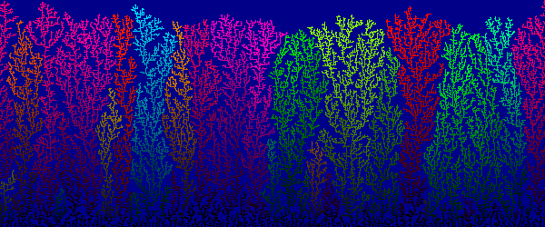

With `hue_diff = 15`, there are wild colour variations:

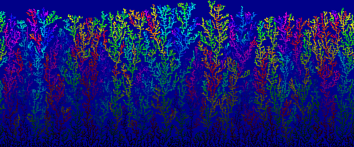

### `p_brightness`

Each step along a coral grows brighter with a probability proportional to `p_brightness`. Must be a nonnegative float. Good values are typically slightly less than 1.

With `p_brightness = 0.1`, the image is very dark:

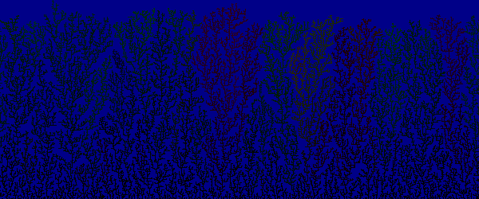

With `p_brightness = 100`, only the very bottom of the corals is dimmed:

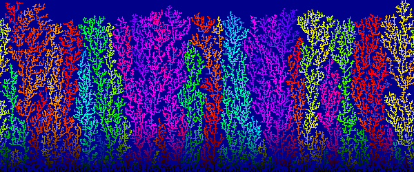

### `down_bias`

Controls the vertical motion of drifting cells. Must be a float between 0 and 1. A good range of values is 0.1 to 0.5.

**Warning**: very low values make the simulation extremely slow.

With `down_bias = 0`, drifters drift purely at random. This produces very sparse patterns, more like seaweed than coral.

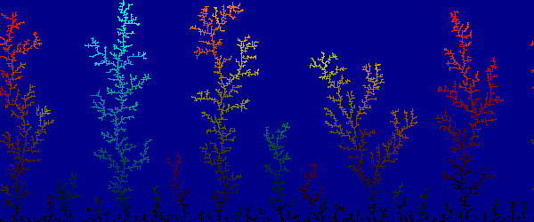

With `down_bias = 1`, drifters fall directly downwards. This produces tightly-packed corals.

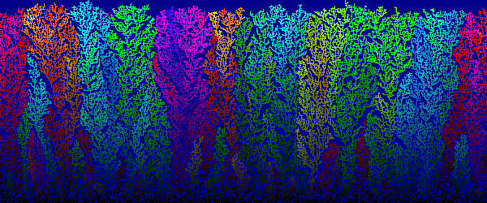

### `right_bias`

Controls the horizontal motion of drifting cells. Must be a float between -1 and 1. A good range of values is -0.1 to 0.1.

With `right_bias = -1`, drifters only ever move left. The resulting corals tilt sharply to the right.

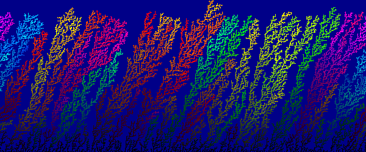

With `right_bias = 1`, the opposite holds.

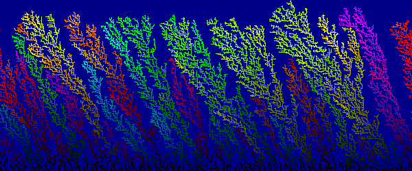

## `run()` options

To monitor the simulation, you can display the step count and the generated image periodically.

````python
board.run(print_step = 1000, image_step = 10000, fname = 'save_prefix-')
````

| Argument      | Type    | Default | Effect                                                              |
|---------------|---------|--------:|---------------------------------------------------------------------|
| `print_step`  | int ≥ 0 |       0 | print step count every `print_step` steps (0 for never)             |
| `image_step`  | int ≥ 0 |       0 | generate snapshot image every `image_step` steps (0 for never)      |
| `save_prefix` | string  |    None | prefix of snapshot save file; if missing, display instead of saving |

## `print_to_image` options

You can choose whether or not to display the drifting cells.

````python
board.print_to_image(show_drifters = True)
````

| `show_drifters` | Image                                                        |
| ----------------|:------------------------------------------------------------:|
| False (default) | 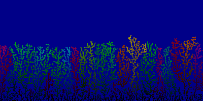   |
| True            | 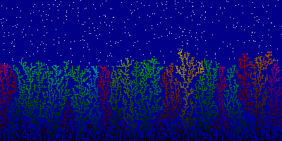 |
